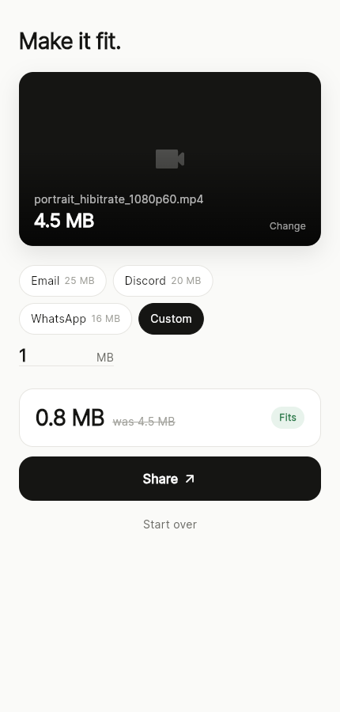

# Make It Fit

Get a phone video under a size limit and share it. One screen: choose a video, tap what it
has to fit under (Email 25 MB, Discord 20 MB, WhatsApp 16 MB, or any number), press
**Make it fit**, share. The app asks the encoder for a little under the limit, checks the real
file size, and tries again smaller if it missed, up to three passes.

No ads, no account, no network, no sliders. Nothing leaves the phone. The original is never
touched, and the result is never larger than the original.

Built on [`compress_video`](https://pub.dev/packages/compress_video) (Media3 Transformer on
Android, AVFoundation on iOS and macOS).

<p> </p>

## Develop

```sh
flutter run                                   # Android, iOS or macOS
flutter test                                  # unit + widget tests
flutter test integration_test -d <device>     # the fit loop on a real engine
```

The integration test proves a 4.4 MB 1080p60 clip comes out under a 1 MB limit.

## Test on your iPhone

On the Mac, with the phone plugged in and unlocked:

```sh
git clone https://github.com/danieljamesjohnson/make-it-fit.git && cd make-it-fit
bash tool/iphone.sh
```

The first run needs a signing team: open `ios/Runner.xcworkspace` in Xcode once, select the
Runner target, Signing & Capabilities, tick "Automatically manage signing" and choose your
Apple ID. On the phone, trust the developer profile under Settings > General > VPN & Device
Management. After that `bash tool/iphone.sh` alone is enough.
