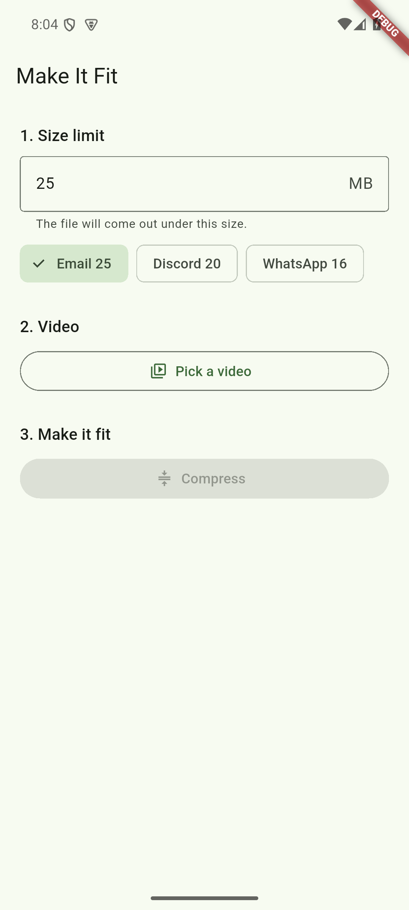

# Make It Fit

Get a phone video under a size limit and share it. One screen, three steps:

1. **Size limit** — type a number of MB, or tap Email 25, Discord 20, WhatsApp 16.
2. **Video** — pick one with the system picker (no photo-library permission needed).
3. **Compress** — the app asks the encoder for a bit under the limit, checks the real file
   size, and tries again smaller if it missed, up to three passes. Then Share.

No ads, no account, no network, no sliders. Nothing leaves the phone. The original is never
touched, and the result is never larger than the original.

Built on [`compress_video`](https://pub.dev/packages/compress_video) (Media3 Transformer on
Android, AVFoundation on iOS and macOS).



## Develop

```sh
flutter run                                   # Android, iOS or macOS
flutter test                                  # unit + widget tests
flutter test integration_test -d <device>     # the fit loop on a real engine
```

The integration test proves a 4.4 MB 1080p60 clip comes out under a 1 MB limit.
